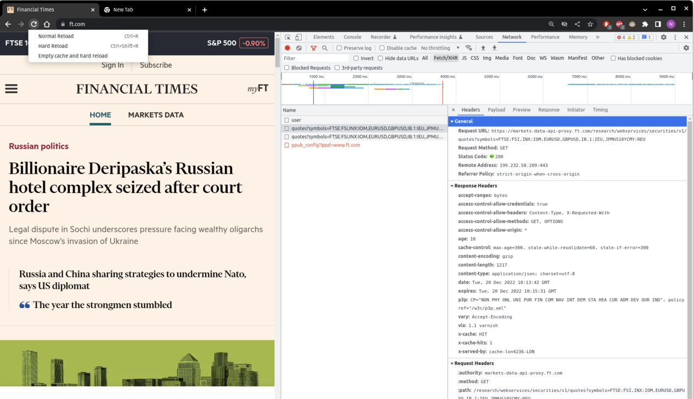

# Market Data Banner

The banner above for financial index returns (FTSE100, ...) is generated using data from FT and scraped using GitHub Actions.

## Scraping

I found the endpoint FT was using to query for data in their market data banner using Chrome's devtools:

1) Go to the FT website and open the `devtools` (right click anywhere on the page -> Inspect)
2) Click on the `Network` tab, then `Fetch/XHR`
3) Right click on the reload button and click `Empty cache and hard reload`
4) Look through the network activity for the market datat requests
5) Copy the request parameters (URL, method (GET, POST), headers) to use in your own script

## Scheduling

This uses GitHub actions to run the scraping script every 5 minutes. I adapted the workflow from [this](https://www.swyx.io/github-scraping) tutorial.

## Troubleshooting

Querying FT requires no extra headers. Other websites may require explicit headers in the request, eg repeating the above for Bloomberg's website we find the endpoint https://www.bloomberg.com/markets2/api/tickerbar/uk, but this will only return data if a suitable user-agent is specified in the header, eg Mozilla/5.0 (X11; Linux x86_64) AppleWebKit/537.36 (KHTML, like Gecko) Chrome/108.0.0.0 Safari/537.36

